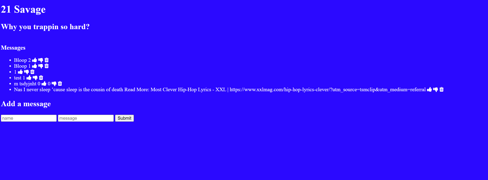

Link to project:https://savage-demo-khvk.onrender.com
 ## How It's Made:
 Tech used: EJS, CSS, JavaScript, Node.js, MongoDB

 This application offers an interactive platform where users can discover and engage with their favorite rappers.Each rapper can receive likes, boosting their popularity and moving them up the rankings. Users can also dislike rappers or remove them entirely from the list, allowing for a personalized and constantly evolving display of musical talent shaped by user preferences.

## Installation

1. Clone repo
2. run `npm install`

## Usage

1. run `npm run savage`
2. Navigate to `localhost:3000`
